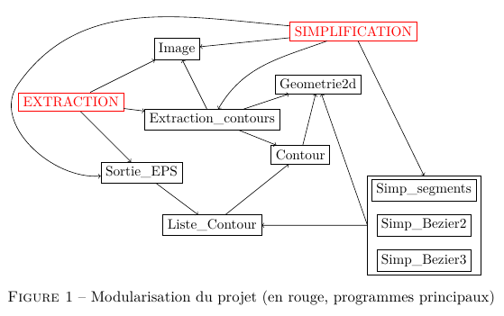

# Projet de MAP 401 -- Simplification d'images
Simplification d'images bitmap en images vectorielles. Langage C


## Copier les sources

On peut utiliser simplement la commande :

```
git clone https://github.com/eyhc/map401-simplifications-images.git
```

## Composition du projet

Le projet est constitué selon la figure suivante.



Dans ce schéma, nous n'avons pas mis les programmes de tests.


---


## Compilation

La compilation est triviale via la commande `make` qui génère des fichiers exécutables `extraction` et `simplification`.

Si l'on souhaite ne compiler qu'un seul des deux fichiers, on peut entrer seulement une des deux commandes suivantes.

```
make extraction
make simplification
```

Pour compiler un programme de tests (de fonctions particulières) on utilise toujours `make nom_fichier_test`.

## Extraction des contours

La partie extraction (tâche 5) permet de déterminer tous les contours et éventuellement les écrire dans un fichier PostScript.

Le programme `extraction` propose plusieurs options. On donne ci-dessous une syntaxe générale qu'on explique ensuite.

```
Usage: ./extraction fichier_image type_sortie fichier_sortie [mode]
    type_sortie: eps | txt 
    mode (dans le cas eps): FILL | STROKE  (par defaut: FILL)
```

Les arguments se présentent comme suit.

1. `fichier_image` : On donne le chemin de l'image source au format bitmap.
2. `type_sortie` : Il existe deux sorties possibles : `eps` ou `txt`. Dans le premier cas, le programme écrira le fichier au format PostScript dans le fichier indiqué par le chemin `fichier_sortie`. Dans le second cas le programme écrira dans le fichier donné par ce même paramètre, la liste des contours sous forme de texte.
3. `mode` : Ce paramètre est optionnel, il sert à indiquer le mode d'affichage de l'image postscript. Le mode `FILL` correspond à un remplissage des contours alors que `STROKE` n'affichera que les contours sans les remplir.

__Exemples__

```
./extraction toto.pbm eps toto.eps STROKE
./extraction toto.pbm txt toto.txt
./extraction toto.pbm eps toto.eps
```


## Simplification de l'image

L'exécutable simplification (tâches 6 et 7) permet de simplifier l'image en la composant au choix: de segments, de courbes de Bézier de degré 2 ou de degré 3. Il permet également d'écrire l'image simplifiée au format PostScript.

Pour l'exécuter il faut faire la commande suivante.

```
./simplification image_source type_simplification dist_seuil [image_dest]
```

Les arguments sont alors :
1. `image_source` : chemin du fichier contenant l'image source au format bitmap,
2. `type_simplification` : un entier entre 1 et 3 avec les correspondances suivantes:
	* 1 correspond à la simplification par segments,
	* 2 correspond à la simplification par courbe de Bézier de degré 2,
	* 3 correspond à la simplification par courbe de Bézier de degré 3.
3. `dist_seuil` : Il s'agit d'entrer un nombre (possiblement à virgule) qui servira de distance seuil pour la simplification. Cette distance correspond à la distance maximale entre un point de l'image source et l'élément simplifié.
4. `image_dest` : Optionnel si aucun nom de fichier n'est mis. Sinon il écrit le résultat de la simplification au format PostScript dans le fichier de chemin ainsi donné.


__Exemples__

```
./simplification toto.pbm 1 2.45 toto1.eps
./simplification toto.pbm 2 0 toto2.eps
./simplification toto.pbm 3 45
```